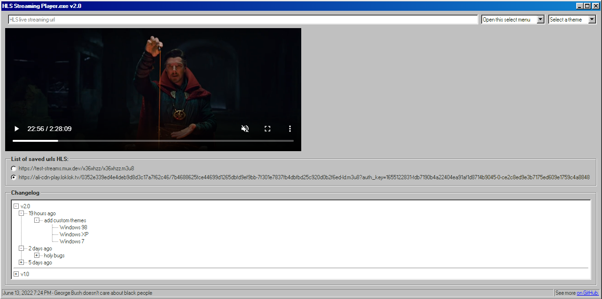
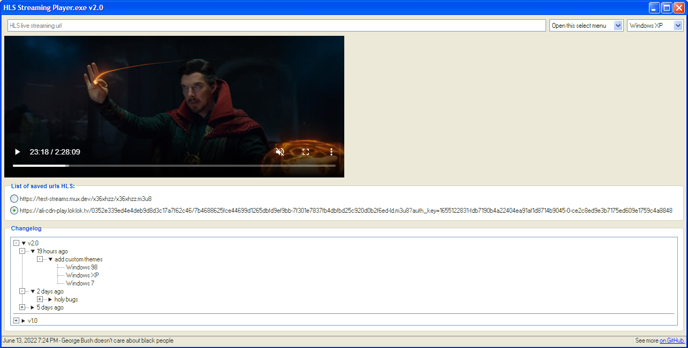
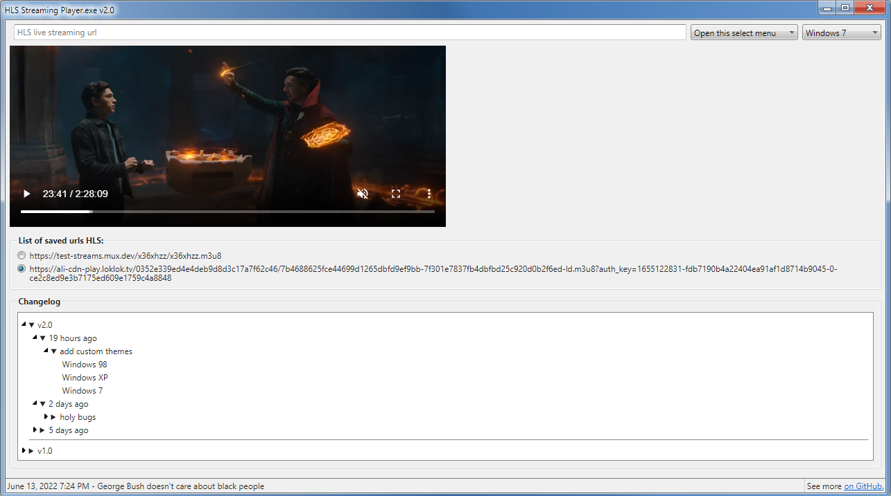

# HLS Streaming Player

### Screenshot

_Windows 98_

_Windows XP_

_Windows 7_

### Library

| libraryName                                                 | versionNumber | commitID |
| ----------------------------------------------------------- | ------------- | -------- |
| [98.css](https://github.com/jdan/98.css)                    | 0.1.18        |          |
| [XP.css](https://github.com/botoxparty/XP.css)              | 0.3.0         |          |
| [7.css](https://github.com/khang-nd/7.css)                  | 0.7.0         |          |
| [Moment.js](https://github.com/moment/moment/)              | 2.29.3        |          |
| [validator.js](https://github.com/validatorjs/validator.js) | 13.7.0        |          |
| [HLS.js](https://github.com/video-dev/hls.js/)              | 1.1.5         |          |
| [kanye.rest](https://github.com/ajzbc/kanye.rest)           |               | 11d4b2b  |

### Deploy

- on [Netlify](https://hls-streaming-player.netlify.app/)
- on [Cloudflare Pages](https://hls-streaming-player.pages.dev/)
- on [Vercel](https://hls-streaming-player.vercel.app/)
